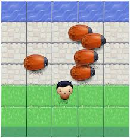

# Frogger Arcade Game

## Table Of Contents
* [Instructions](#instructions)
* [Implementation](#implementation)
* [Dependencies](#dependencies)
* [Demo](#demo)

## Instructions
Hello there! Welcome to my Frogger Arcade Game! :satisfied: In this game, bugs are your enemies and collectibles are your friends. Your goal is to reach the water tiles without colliding with any of the bugs.  Avoid the bugs and pick up as many collectibles as you can while moving up from level 1 to level 10. A collision with a bug will cost you some points while collectibles will add gallant points to your score. You can move up, down, left and right with your arrow keys on laptops or swipe left, right, up and down on mobile devices and other smaller screens.

**Pick any character you prefer and Play away! :smiley:**

## Implementation
The starter file for this app was provided by Udacity contatining HTML, CSS and JavaScript: app.js, engine.js and resources.js and images folders. I built on the game by editing the app.js file. The app engine (engine.js) was only edited to render and update new classes that I created in app.js.

You can run this game by opening index.html in a browser. You'd need a good internet connection to successfully run and play this game.

## Dependencies
The game largely depends on the png images that were provided by Udacity in the images folder. These images make up the canvas, the bugs, player and collectibles. Without these images, this Frogger Arcade game is just text.

## Demo
To view this app live and play the game, [Click here](https://laludztee.github.io/Frogger-Arcade-Game/)
